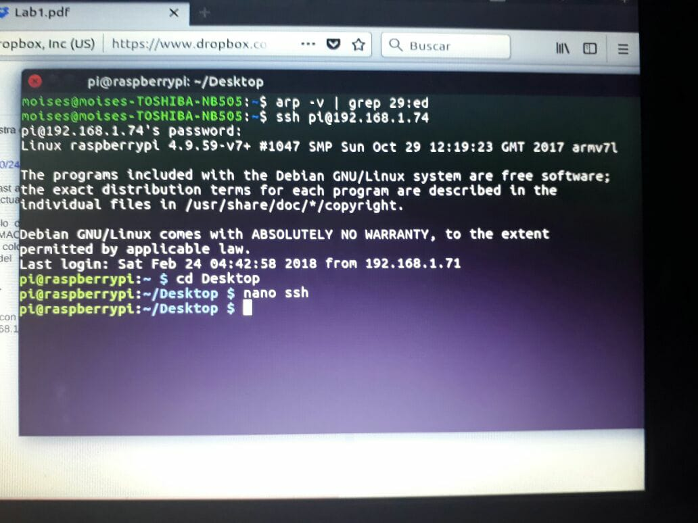

# Práctica uso de Raspberry

## Integrantes:

Badillo Ramírez Jorge Luis
Carrizo García Dulce Carolina
Martinez Vilchis Juan Moises

## Desarrollo.
En esta práctica se aprendió a tener acceso a la Raspberry PI 3 mediante las siguientes maneras:

* VNC 
* SSH
* UART

Para poder acceder a la Raspberry, primero se configuro la conexion wifi.
A continuación se muestra la imagen referente a los datos obtenidos mediante el comando ifconfig, como lo es la dirección ip.

### VNC

VNC sirve para tener una conexión remota entre una pc (cliente) y la raspberry (servidor), para ello fue necesario descargar REALVNC viewer.

A continuación se muestra el estatus de VNC en la Raspberry.

Datos referentes sobre el servidor VNC en la pc.

La aplicación de REALVNC viewer mostrando la pantalla del escritorio de la Raspberry.

### SSH
En la configuración que tiene por default la Raspberry PI 3 se tenía inhabilitado el protocolo SSH, por lo que se procedió a habilitar.

A continuación se muestra la imagen sobre el estatus del servidor ssh en la tarjeta raspberry.

Se realizó un broadcast para escanear el puerto 22. 

También se ejecutó el protocolo ARP.

### UART

Finalmente se empleo la conexión USB serial mediante un módulo FT-232, haciendo uso del header de la raspberry para conectar las señales de control de la interfaz de conexión uart.

Por lo tanto se verificó que el sistema operativo (ubuntu) de la pc reconociera el módulo FT-232 en dev como ttyUSB0. Así mismo se estableció el baudaje de 115200.

A continuación se muestra la imagen de la consola cuando se accede a la Raspberry.

En las tres formas de interactuar con la Raspberry, se genero una archivo para verificar la conexion con la misma.

